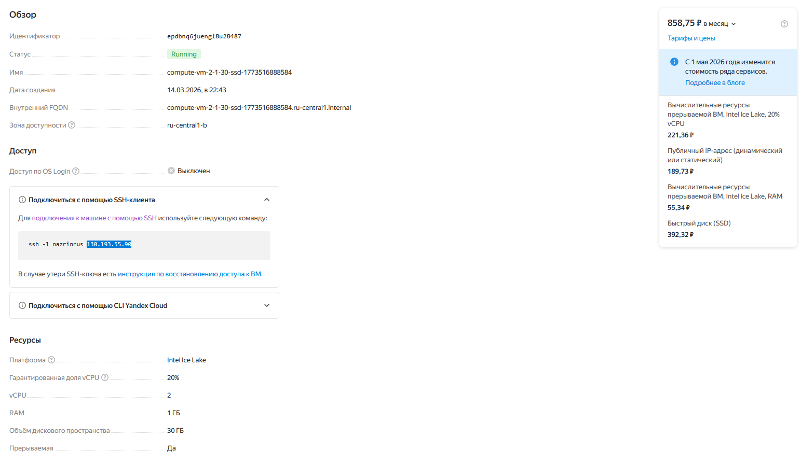

1. Развернул виртуальную машину на Yandex Cloud, со следующими параметрами:

2. Установил PostgreSQL, демобазу. Настроил доступ к БД снаружи:
`vim /tmp/install_pg.sh`
```
#!/bin/bash
sudo sh -c 'echo "deb http://apt.postgresql.org/pub/repos/apt $(lsb_release -cs)-pgdg main" > /etc/apt/sources.list.d/pgdg.list'
sudo wget -qO- https://www.postgresql.org/media/keys/ACCC4CF8.asc | sudo tee /etc/apt/trusted.gpg.d/pgdg.asc &>/dev/null 
sudo apt update
PGVERSION=14
sudo apt install postgresql-${PGVERSION?} postgresql-${PGVERSION?}-repack postgresql-${PGVERSION?}-dbgsym postgresql-client-${PGVERSION?} unzip -y
echo "listen_addresses = ' * '" | sudo tee -a /etc/postgresql/${PGVERSION?}/main/postgresql.conf > /dev/null
echo 'host    all             all             0.0.0.0/0              scram-sha-256' | sudo tee -a /etc/postgresql/${PGVERSION?}/main/pg_hba.conf > /dev/null
sudo sed -i 's|host    all             all             127.0.0.1/32            scram-sha-256|host    all             all             127.0.0.1/32            trust|g' /etc/postgresql/${PGVERSION?}/main/pg_hba.conf
sudo systemctl restart postgresql.service
sudo psql -U postgres -h 127.0.0.1 -c "alter user postgres with password 'postgres';"
sudo wget https://edu.postgrespro.ru/demo-medium.zip -O /tmp/demo-medium.zip
sudo unzip /tmp/demo-medium.zip -d /tmp/
sudo psql -U postgres -h 127.0.0.1 < /tmp/demo-medium-20170815.sql
```
`bash install_pg.sh`
3. Локальное подключение:
```
nazrinrus@compute-vm-2-1-30-ssd-1773516888584:/tmp$ sudo -iu postgres
postgres@compute-vm-2-1-30-ssd-1773516888584:~$ psql
psql (14.22 (Ubuntu 14.22-1.pgdg24.04+1))
Type "help" for help.

postgres=# \l+
                                                                List of databases
   Name    |  Owner   | Encoding | Collate |  Ctype  |   Access privileges   |  Size   | Tablespace |                Description                 
-----------+----------+----------+---------+---------+-----------------------+---------+------------+--------------------------------------------
 demo      | postgres | UTF8     | C.UTF-8 | C.UTF-8 |                       | 703 MB  | pg_default | 
 postgres  | postgres | UTF8     | C.UTF-8 | C.UTF-8 |                       | 8595 kB | pg_default | default administrative connection database
 template0 | postgres | UTF8     | C.UTF-8 | C.UTF-8 | =c/postgres          +| 8441 kB | pg_default | unmodifiable empty database
           |          |          |         |         | postgres=CTc/postgres |         |            | 
 template1 | postgres | UTF8     | C.UTF-8 | C.UTF-8 | =c/postgres          +| 8595 kB | pg_default | default template for new databases
           |          |          |         |         | postgres=CTc/postgres |         |            | 
(4 rows)
```
4. Удаленное подключение:
```
(ansible) nazrinrus@desktop:~$ PGPASSWORD='postgres' psql -h 130.193.55.90 -p 5432 -U postgres -d demo
psql (16.13 (Ubuntu 16.13-0ubuntu0.24.04.1), server 14.22 (Ubuntu 14.22-1.pgdg24.04+1))
SSL connection (protocol: TLSv1.3, cipher: TLS_AES_256_GCM_SHA384, compression: off)
Type "help" for help.

demo=# \dt
               List of relations
  Schema  |      Name       | Type  |  Owner   
----------+-----------------+-------+----------
 bookings | aircrafts_data  | table | postgres
 bookings | airports_data   | table | postgres
 bookings | boarding_passes | table | postgres
 bookings | bookings        | table | postgres
 bookings | flights         | table | postgres
 bookings | seats           | table | postgres
 bookings | ticket_flights  | table | postgres
 bookings | tickets         | table | postgres
(8 rows)

demo=# 
```
